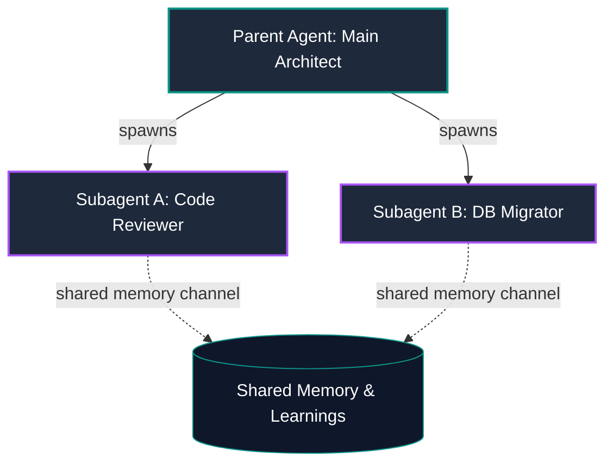

# Stratum

> **Bespoke Workspace & Development Runtime by Atelier Scintilla**  
> A hybrid local-remote agentic operating environment designed to bridge high-craft user interfaces with raw, developer-first AI autonomy.

---

## 🌌 The Stratum Philosophy

Stratum is not another conversational wrapper. It is an agentic development runtime built on the belief that **software tools should feel premium, responsive, and mathematically sound**. We do not model AI agents after human minds; we model them as scoped, virtual engines operating within strict physical and virtual boundaries.

```
┌──────────────────────────────────────────────────────────┐
│                    Atelier Scintilla                     │
│                        (Desktop)                         │
└────────────────────────────┬─────────────────────────────┘
                             │ (SSE / Remult Client)
                             ▼
┌──────────────────────────────────────────────────────────┐
│                   Stratum Hono Gateway                   │
│         (SQLite, AES Keys, Policy-Based Outbox)          │
└────────────────────────────┬─────────────────────────────┘
                             │
            ┌────────────────┴────────────────┐
            ▼ (Local Run)                     ▼ (Remote sshfs Sync)
┌───────────────────────┐         ┌───────────────────────┐
│     Local Workspace   │         │    Remote Host VM     │
│  ~/.stratum/workspace │         │    Virtual Mount      │
└───────────────────────┘         └───────────────────────┘
```

---

## 🧠 Tiered Scoped Memory System (Mnemosyne Architecture)

Rather than treating AI memory as a human-like stream of consciousness, Stratum segregates memory into **hierarchical, task-relevant layers**. This keeps context windows highly dense, reduces model confusion, and ensures correct scoping.

```
                      [ GLOBAL GENERAL MEMORY ]
                       - System settings & APIs
                                  │
                                  ▼
                     [ PROJECT-LEVEL MEMORY ]
                      - Repository mappings & APIs
                                  │
                                  ▼
                     [ AGENT-SPECIFIC MEMORY ]
                      - Tool profiles & specializations
                                  │
                                  ▼
                      [ TASK / SESSION MEMORY ]
                       - Git checkpoints & active loops
```

* **Global Memory:** Universal user preferences, API access permissions, and cross-session learnings.
* **Project Memory:** Codebase structure maps, local documentation, code-splitting rules, and architectural guidelines (e.g., `AGENTS.md`).
* **Agent-Type Memory:** Specific specialized capabilities, fine-tuned developer prompts, and tool access boundaries.
* **Task/Session Memory:** Ephemeral context, git checkpoint hashes, active compiler outputs, and short-term reasoning traces.

---

## 🌿 Visual Subagent Branches & Kanban Graph

Traditional Kanban boards are flat and unsuited for parallel agent task execution. Stratum visualizes operations as a **branching execution tree** representing parent-to-child subagent delegations.



* **Branching Delegation:** Watch subagents fork to run checks, compile code, or research documentation concurrently.
* **Kanban-Graph Hybrid:** Tasks flow through columns, but remain visually linked to the parent subagent node that spawned them.
* **Shared Learnings Channel:** Subagents in the same branch sync updates and execution learnings instantly to prevent repetitive steps.

---

## 📂 Mirage Virtual Filesystem

Stratum integrates external services directly into the agent's filesystem context. Instead of teaching agents complex custom APIs for email, webhooks, or Slack, Stratum mounts these services as virtual files.

* **Emails as Files:** Reading an incoming email is as simple as running `read("/mount/mirage/emails/inbox/mail_104.md")`.
* **Outbox Actions:** Sending an email or webhook is triggered by writing a file to `/mount/mirage/emails/outbox/`.
* **API Uniformity:** Agents can run standard Unix tools (`grep`, `find`, `cat`) over Slack messages, databases, and emails, unifying all data streams.

---

## ⚡ Hybrid Dev Runtime & Electrobun Desktop App

Stratum is designed to go wherever you develop, packaged inside a sleek desktop shell.

* **Electrobun Desktop Wrapper:** A high-performance, lightweight Chromium/Webkit container wrapping the SvelteKit frontend and Hono gateway, providing deep system access, custom hotkeys, and menu controls.
* **Local-to-Remote Hot Swap:** Switch from running agents locally in `~/.stratum/workspace` to remote execution environments in one click.
* **Virtual SSHFS Sync:** Connect to remote virtual machines, cloud sandboxes, or production testing servers. Files are automatically synchronized under the hood, presenting a local-first interface to both user and agent.
* **DeepResearch mode:** Spawns specialized crawling agents to run broad web searches, crawl API docs, and build context before proposing code edits.

---

## 🛡️ Reversibility-Based Safety Gates (RBAG)

To protect your system while keeping developer momentum high, Stratum utilizes the **RBAG** model:

1. **Pre-Execution Checkpoint:** Before the agent runs any write or terminal tool inside `~/.stratum/workspace`, a silent Git checkpoint is generated.
2. **Auto-Run Execution:** The agent writes the code and compiles the project without intermediate confirmation prompts.
3. **One-Click Rollback:** If the compilation fails or code is incorrect, click `[Rollback Changes]` in the UI to reset the workspace to the pre-execution checkpoint, fully restoring your original dirty files and deleting new untracked agent files.
4. **Auto-Finalization:** Once you send a new prompt, past checkpoints are cleanly merged and finalized.

---

## 🛠️ Monorepo Structure

Stratum is structured as a Turborepo using Bun workspaces:

```
stratum/
├── apps/
│   ├── frontend/     # SvelteKit 5 UI (Neon Teal & AI Slate theme)
│   └── gateway/      # Hono + Remult + pi-ai backend controller
├── packages/
│   └── shared/       # Shared Remult entities & TypeScript types
└── package.json      # Monorepo configuration
```

---

## 🚀 Development Commands

```bash
# Install dependencies
bun install

# Start both gateway and frontend
bun run dev          # Runs turbo run dev

# Run individual workspaces
cd apps/gateway && bun dev       # Hono backend (port 3001)
cd apps/frontend && bun dev      # SvelteKit (port 5173)

# Build the project
bun run build

# Run safety gate verification tests
cd apps/gateway && bun test
```

---

*Atelier Scintilla — High-Craft Human-AI Runtimes.*
