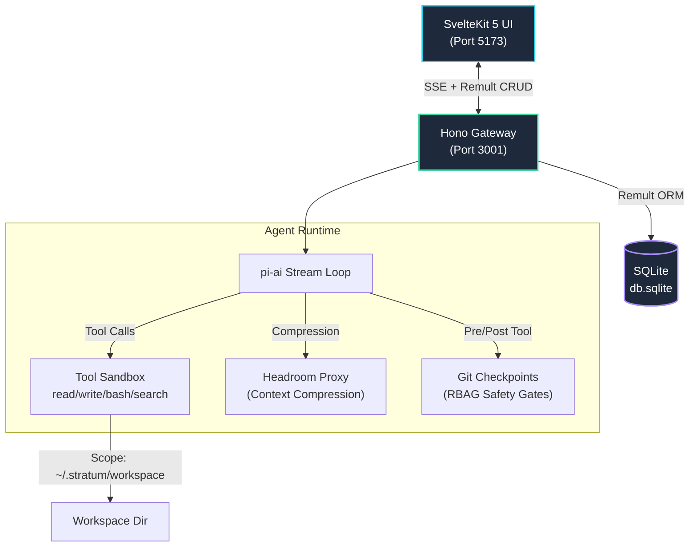
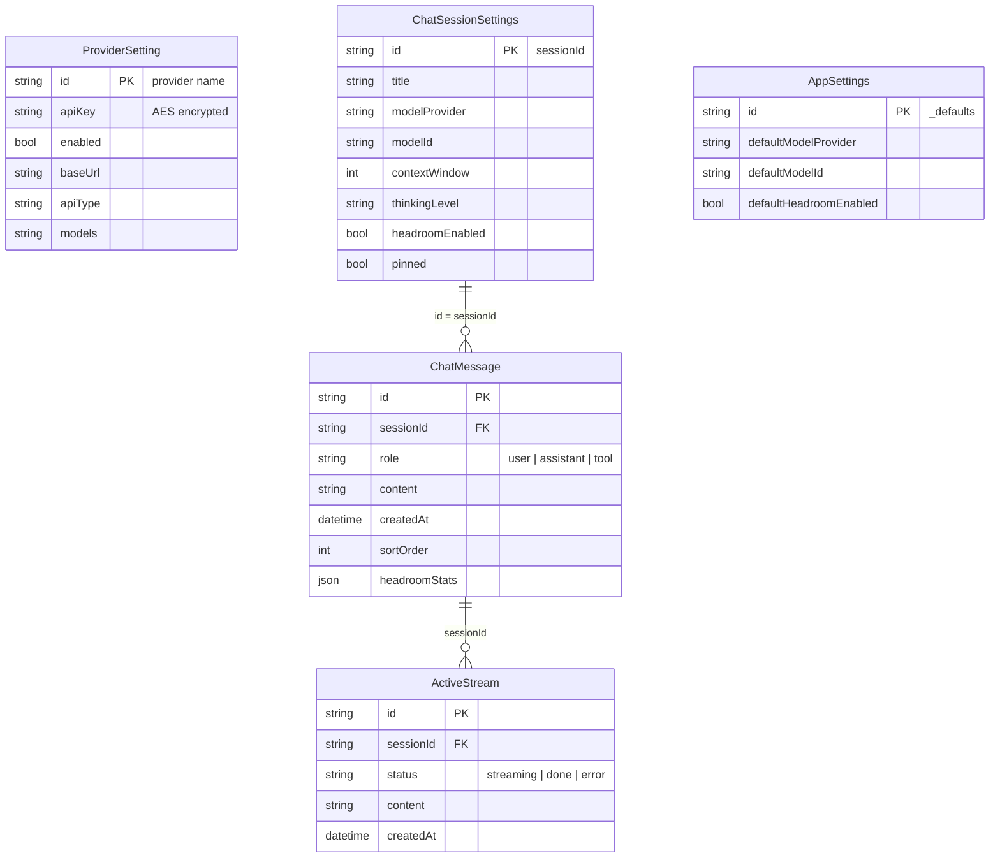

<p align="center">
  <picture>
    <source media="(prefers-color-scheme: dark)" srcset="https://github.com/Kobo-Scintilla/stratum/raw/main/apps/frontend/static/logo.png">
    
  </picture>
</p>

<h1 align="center">Stratum</h1>

<p align="center">
  <b>Agentic runtime & chat dashboard by <a href="https://github.com/Kobo-Scintilla">Kobo Scintilla</a></b><br>
  <i>SvelteKit 5 · Hono · Remult · pi-ai · Headroom</i>
</p>

<p align="center">
  <a href="#done"></a>
  <a href="#-work-in-progress"></a>
  <a href="LICENSE"></a>
</p>

---

Stratum is a **hybrid human–AI development runtime**. It pairs a responsive chat UI with an agent execution loop, tool sandbox, context compression, and reversibility safety gates. The monorepo is structured for iteration — what's done is real, what's planned is flagged.

## 🚦 What's Done vs What's Not

| Layer | Status |
|-------|--------|
| Chat dashboard & session management | ✅ Done |
| Agent streaming loop (pi-ai) | ✅ Done |
| Tool execution sandbox (read/write/bash/search) | ✅ Done |
| Headroom context compression | ✅ Done |
| Git checkpoint safety gates (RBAG) | ✅ Done |
| Multi-provider key management (30+ providers) | ✅ Done |
| AES-256-GCM encrypted API keys | ✅ Done |
| Thinking/reasoning levels & UI | ✅ Done |
| **Tiered scoped memory (Mnemosyne)** | 🔶 Partial — session history only |
| **Subagent branching & DAG** | 🔶 Partial — registry exists, single agent |
| **Mirage Virtual Filesystem** | ❌ Not started |
| **Electrobun desktop packaging** | ❌ Not started |
| **SSHFS remote sync** | ❌ Not started |
| **DeepResearch mode** | ❌ Not started |
| **Subagent Kanban UI** | ❌ Not started |

---

## 🧱 System Architecture

<p align="center">
  <picture>
    <source media="(prefers-color-scheme: dark)" srcset="https://github.com/Kobo-Scintilla/stratum/raw/main/docs/architecture.svg">
    
  </picture>
</p>

*Animated SVG — data flow dots pulse along connection lines. Open in browser to see animation.*



### Components

- **Frontend** — SvelteKit 5 dashboard with chat UI, session list, provider manager, settings. Dark petroleum/teal theme. Live queries via Remult SSE.
- **Gateway** — Hono HTTP server. Hosts Remult REST + admin UI. Manages agent lifecycle, encryption, CORS.
- **Agent Runtime** — pi-ai `streamSimple` loop with tool call round-trips. Handles text deltas, tool starts/ends, thinking markers, errors.
- **Headroom** — Optional context compression via `headroom-ai[proxy]`. Auto-installs Python venv, spawns proxy. Configurable per session.
- **Git Checkpoints** — Auto-commit workspace before tool execution. One-click rollback in UI. Preserves user dirty state across checkpoints.

---

## 🗄️ Data Model



Five Remult entities, SQLite with WAL mode. Indexed on `sessionId` and `sortOrder`.

---

## ✅ What's Done

### Chat Dashboard
- Message list with streaming display, thinking blocks, tool call cards, Markdown rendering
- Session sidebar: list, create, rename, pin, delete
- Provider sidebar: search 30+ providers, add custom, set API key, enable/disable
- Settings panel: default model, thinking level, Headroom toggles, title summary model
- Live query SSE sync — real-time UI updates
- Mobile-responsive sidebar sheet
- Dark theme (AI Slate + Neon Teal + Verdigris)
- Token usage stats per message

### Agent Execution
- Full pi-ai streaming loop with multi-turn tool execution
- Tool sandbox: `read`, `write`, `edit`, `bash`, `search` (grep+find), `get_time`
- All tools scoped to `~/.stratum/workspace`
- Tool call round-trips: LLM → tool → result → LLM → done
- Throttled SSE updates (100ms) to ActiveStream in DB

### Headroom Compression
- Auto-detect Python, create venv, pip install `headroom-ai[proxy]`
- Spawn proxy, health check polling, graceful SIGTERM shutdown
- OpenAI message format bridge (pi-ai ↔ Headroom)
- Session-level overrides: enabled, code AST, kompress model, CCR
- Streaming install UI via SSE endpoint
- Compression stats saved to both ActiveStream and ChatMessage

### RBAG Safety Gates (Git Checkpoints)
- `createCheckpoint()` — auto-init git repo, commit dirty state
- `rollbackToCheckpoint()` — hard reset + clean, restore user dirty state
- `completeCheckpoint()` — soft reset to merge user + agent changes
- Integrated into `runStreamLoop()`: checkpoint before tools, finalize on new turn
- `[Rollback Changes]` button in ChatMessage UI
- Tested: 4 test cases (clean, dirty, rollback, complete)

### Provider Management
- 30+ built-in providers: OpenAI, Anthropic, Google, Groq, DeepSeek, Mistral, OpenRouter, etc.
- Custom provider support (baseUrl, apiType, model list)
- AES-256-GCM key encryption with scrypt derivation
- Per-provider enable/disable toggle

### Thinking / Reasoning
- Extended levels: off / minimal / low / medium / high / xhigh
- Stream parsing for `<|THINK_START|>` / `<|THINK_END|>` markers
- Thought filtering (skip trivially short thoughts)
- Visual `AgentActivity` component for thinking + tool call display
- Collapsible thinking blocks

---

## 🔶 Partially Done

### Mnemosyne Tiered Memory
- **Claim:** 4 scoped layers (Global → Project → Agent-Type → Session)
- **Reality:** Only session-level history exists — loads last 200 messages from SQLite
- **Missing:** Global memory store, project memory parser (`AGENTS.md` ingestion), agent-type memory profiles
- The concept is designed; the data structures aren't built yet

### Subagent System
- **Claim:** Parent-child DAG, branching execution, shared learning pool
- **Reality:** `AgentRegistry` class exists (register/get/list) but only one agent ("assistant") is registered
- **Missing:** Subagent spawning, parent-child tracking, DAG data structure, shared pool channel

---

## 🚧 Work In Progress

These features are described in the vision but have **zero implementation** yet:

| Feature | Description |
|---------|-------------|
| **Mirage VFS** | Mount external services (Gmail, Slack, GitHub, Postgres) as virtual directories under `/mount/mirage/`. Agents use `read`/`write`/`grep` on them. No API code needed. |
| **Electrobun Desktop** | Native desktop shell hosting the SvelteKit frontend. System tray, global hotkeys, shell hooks. |
| **SSHFS Remote Sync** | Mount remote VMs, Docker containers, staging hosts via SSH. Real-time file sync for local agent editing on remote targets. |
| **DeepResearch Mode** | Spawn crawling agents for concurrent web search, API doc indexing, remote code ingestion. |
| **Subagent Kanban UI** | Visual branching graph + Kanban board for subagent execution trees. Sync to GitHub Projects. |

---

## 📁 Monorepo Structure

```
stratum/
├── apps/
│   ├── frontend/        # SvelteKit 5 UI
│   │   ├── src/
│   │   │   ├── lib/
│   │   │   │   ├── components/     # Chat, sidebar, UI primitives
│   │   │   │   ├── stores/         # Svelte 5 runes state
│   │   │   │   ├── hooks/          # is-mobile
│   │   │   │   ├── server/         # Encryption utils
│   │   │   │   └── utils/          # Thinking, UUID, portal
│   │   │   └── routes/             # Dashboard, API remult catch-all
│   │   └── static/                 # Logo, favicon
│   ├── gateway/          # Hono + Remult + pi-ai backend
│   │   └── src/
│   │       ├── agent-runtime/
│   │       │   ├── tools/          # Tool definitions (get-time.ts)
│   │       │   ├── headroom/       # Proxy, format bridge, compression
│   │       │   ├── __tests__/      # Git checkpoint, Headroom tests
│   │       │   ├── agent-stream.ts # pi-ai loop orchestration
│   │       │   ├── agent-tools.ts  # Tool registry
│   │       │   ├── agent-context.ts# Context builder
│   │       │   ├── agent-registry.ts
│   │       │   └── git-checkpoint.ts
│   │       ├── agent-service.ts    # Remult controller
│   │       ├── api.ts              # Remult API setup
│   │       ├── encryption.ts       # AES-256-GCM
│   │       └── index.ts            # Hono server entry
│   └── ...shared symlinks
├── packages/
│   └── shared/          # Shared Remult entities & types
│       └── src/
│           ├── controllers/        # AgentService definition
│           └── entities/           # ChatMessage, ActiveStream, etc.
├── build/                # Production build output
├── turbo.json            # Turborepo config
└── package.json          # Bun workspaces monorepo
```

---

## 🚀 Quick Start

```bash
# Prerequisites: bun, node 20+, python3 (for Headroom)

# Install
bun install

# Start both gateway and frontend
bun run dev

# Or run individually:
cd apps/gateway && bun dev          # Gateway on :3001
cd apps/frontend && bun dev         # SvelteKit on :5173

# Build
bun run build

# Run tests (gateway)
cd apps/gateway && bun test
```

**Environment variables:**

| Variable | Default | Purpose |
|----------|---------|---------|
| `GATEWAY_PORT` | `3001` | Gateway HTTP port |
| `DATABASE_URL` | `db.sqlite` | SQLite database path |
| `ENCRYPTION_KEY` | (auto-generated) | AES-256-GCM key for API keys |
| `HEADROOM_BASE_URL` | `http://127.0.0.1:5050` | Headroom proxy URL |
| `STRATUM_WORKSPACE_DIR` | `~/.stratum/workspace` | Tool execution sandbox |

---

## 🧪 Tests

```bash
# Gateway tests
cd apps/gateway && bun test

# Test files:
# - src/agent-runtime/__tests__/git-checkpoint.test.ts
# - src/agent-runtime/headroom/__tests__/headroom.test.ts
# - tools-archive/__tests__/ (legacy tool tests)
```

---

## 📌 Status Tags

```
✅ Done       — Fully implemented and verified
🔶 Partial    — Implemented but incomplete
❌ Not started — Planned, zero code
```

---

<p align="center">
  <sub>Built by <a href="https://github.com/Kobo-Scintilla">Kobo Scintilla</a> · Pre-alpha · 2026</sub>
</p>
