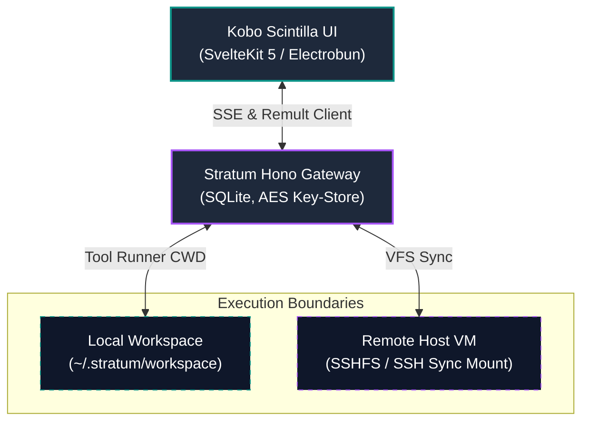
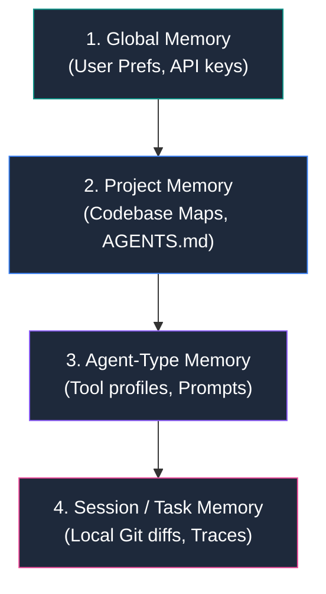
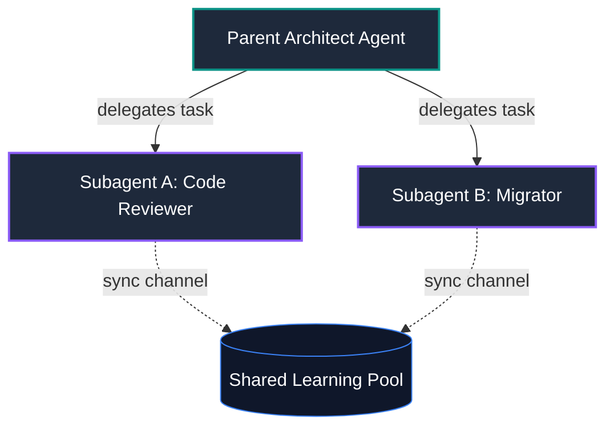
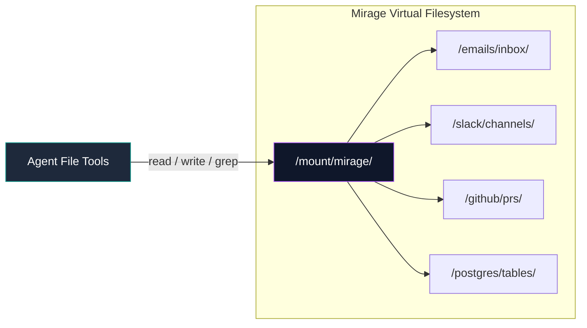

# Stratum

> **Bespoke Workspace & Development Runtime by Kobo Scintilla**  
> A hybrid local-remote agentic operating environment designed to bridge high-craft user interfaces with raw, developer-first AI autonomy.

---

## 🌌 System Architecture

Stratum is a dual-tier agent runtime structured around a responsive client interface, a gateway coordinator, and isolated execution workspaces.



* **Frontend Client:** Built using Svelte 5 and SvelteKit, executing inside an Electrobun window wrapper for local system integration, hotkeys, and shell hooks.
* **Hono Gateway:** Acts as the central agent execution loop, session coordinator, and key-management container.
* **Execution Workspace:** The agent's file tools and terminal processes are restricted to `~/.stratum/workspace` (locally) or virtual mount points (remotely).

---

## 🧠 Tiered Scoped Memory Architecture (Mnemosyne)

Memory in Stratum is structured hierarchically to restrict context pollution and maximize prompt precision. Rather than a flat text log, context is assembled dynamically from four scoped layers.



* **Global Memory:** Contains cross-session learnings, user preferences, and encrypted API configurations.
* **Project Memory:** Defines codebase paths, directories, libraries, and active structural conventions parsed from root `AGENTS.md` files.
* **Agent-Type Memory:** Scopes what tools the agent can execute (e.g. read-only, FS mutations, network calls).
* **Session/Task Memory:** Holds active terminal buffers, tool outputs, and transient compiler warnings.

---

## 🌿 Subagent Branching Graph & Kanban UI

Subagent execution is modeled as a directed acyclic graph (DAG) representing parent-to-child delegation trees, synced with a branching Kanban workspace.



* **Execution Graph:** Nodes represent individual subagents. Spawned subagents inherit parent context and tool subsets.
* **Shared Learning Pool:** Subagents operating in parallel branches stream structural discoveries (e.g., locating a file, identifying an API bug) to a shared pool to prevent double-work.

---

## 📂 Mirage Virtual Filesystem

Stratum uses Mirage to virtualize integrations. Instead of creating custom tools for Slack, Gmail, GitHub, or Postgres, external services are mounted directly as virtual directories.



* **Unified Input/Output:** Agents inspect emails by reading `/mount/mirage/emails/inbox/` and send responses by writing to `/mount/mirage/emails/outbox/`.
* **Standard Tooling:** The agent searches Slack history or database schemas using standard shell `grep` and file reading commands, completely avoiding API code wrappers.

---

## ⚡ Hybrid Dev Runtime & Electrobun Desktop App

Stratum provides seamless switching between local execution and remote hosting using a virtual sync mechanism.

* **Electrobun Desktop Wrapper:** A high-performance native desktop shell hosting the Svelte 5 frontend and spawning the gateway server.
* **SSHFS Sync:** Mounts remote development servers, Docker containers, or staging host VMs. Files are synchronized in real-time, allowing the local agent to edit and run compilers remotely.
* **DeepResearch mode:** Spawns specialized crawling agents to perform concurrent web searches, index API documentations, and ingest remote code examples.

---

## 🛡️ Reversibility-Based Safety Gates (RBAG)

To protect host systems while maintaining execution velocity, Stratum implements the **RBAG** safety gate workflow:

1. **Pre-Execution Checkpoint:** Before write or terminal tools execute, the gateway creates a Git checkpoint in `~/.stratum/workspace` (committing dirty files silently if present).
2. **Auto-Run Mode:** The agent modifies codebase files and runs compilers without intermediate prompting.
3. **Rollback Hook:** Users can click `[Rollback Changes]` in the UI to instantly revert modifications to the pre-tool state, deleting untracked files and unstaging the original modifications.
4. **Auto-Finalization:** Starting a new generation turn soft-resets the past checkpoint, merging both edits into the unstaged working tree.

---

## 🚧 Active Roadmap & Work In Progress (WIP)

While the core Hono Gateway, Svelte 5 UI, and RBAG Git Checkpoint system are fully implemented and verified, the following features are actively under development:

* **Mnemosyne Memory System:** The gateway currently uses single-history context building; the tiered scoped layers are in active R&D.
* **Subagent Kanban UI:** Subagents can be defined and spawned manually; the branching visual board interface is not yet wired to the frontend.
* **Mirage VFS:** Virtual mounts for email, Slack, and databases are in mock mode; the FUSE/passthrough filesystem layer is under construction.
* **Electrobun Packaging:** Currently runs locally via terminal node servers; native Electrobun desktop packaging is in compilation trials.
* **Remote SSHFS Sync:** SSH remote VM file synchronizer is WIP.

---

## 🛠️ Monorepo Structure

Stratum is structured as a Turborepo using Bun workspaces:

```
stratum/
├── apps/
│   ├── frontend/     # SvelteKit 5 UI (Neon Teal & AI Slate theme)
│   └── gateway/      # Hono + Remult + pi-ai backend controller
├── packages/
│   └── shared/       # Shared Remult entities & TypeScript types
└── package.json      # Monorepo configuration
```

---

## 🚀 Development Commands

```bash
# Install dependencies
bun install

# Start both gateway and frontend
bun run dev          # Runs turbo run dev

# Run individual workspaces
cd apps/gateway && bun dev       # Hono backend (port 3001)
cd apps/frontend && bun dev      # SvelteKit (port 5173)

# Build the project
bun run build

# Run safety gate verification tests
cd apps/gateway && bun test
```

---

*Kobo Scintilla — High-Craft Human-AI Runtimes.*
